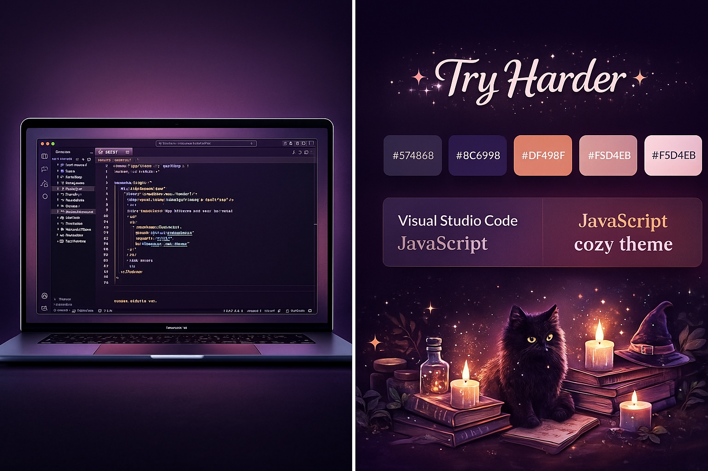

# ✨ Try Harder — A Cozy, Whimsical VS Code Theme  
*A magical coding atmosphere inspired by soft candlelight, fuzzy blankets, warm tea, and late-night witchy vibes.*

Try Harder is a lovingly crafted dark theme designed to make your coding sessions feel **soft, dreamy, and comforting** — like sitting under a pink fluffy blanket with your favorite warm drink while your familiar cat watches you debug spells at midnight.

This theme combines:

- 💜 muted plum and lavender backgrounds  
- 💛 candle-gold highlights  
- 💗 cozy pink accents inspired by fluffy blankets  
- 🧙‍♀️ magical teal + starlight cream for syntax  
- 🌙 gentle contrast optimized for long late-night sessions  

If you want a theme that feels **calming, whimsical, and slightly enchanted**, you're home.

---

## 📸 Preview

Here's a preview of the Try Harder theme in action:



---

## 🚀 Installation

Once available on the Marketplace:

1. Open the **Extensions** view in VS Code  
2. Search for **"Try Harder Theme"**  
3. Install  
4. Open Command Palette → `Preferences: Color Theme`  
5. Select **Try Harder**

---

## 🪄 Recommended Settings

```json
{
  "editor.fontFamily": "JetBrains Mono, Fira Code, Cascadia Code",
  "editor.lineHeight": 1.5,
  "editor.cursorSmoothCaretAnimation": "on",
  "workbench.tree.indent": 12,
  "editor.smoothScrolling": true
}
```

---

## ❄️ Why “Try Harder”?

Because sometimes we all need a gentle reminder…
Not to push harder — but to **try softer**, try cozier, try kinder.

This theme is meant to be your little magical cocoon for deep-focus work or late-night coding rituals.

---

## 🐾 Credits

Inspired by cozy-witch aesthetics, pastel candlelight, autumn evenings, plush blankets, and of course — fluffy wizard cats.

---

## 💌 Feedback & Suggestions

Found a bug? Have an idea?
Feel free to open an issue or create a pull request on GitHub.
Your feedback helps this theme grow its magical powers. ✨

